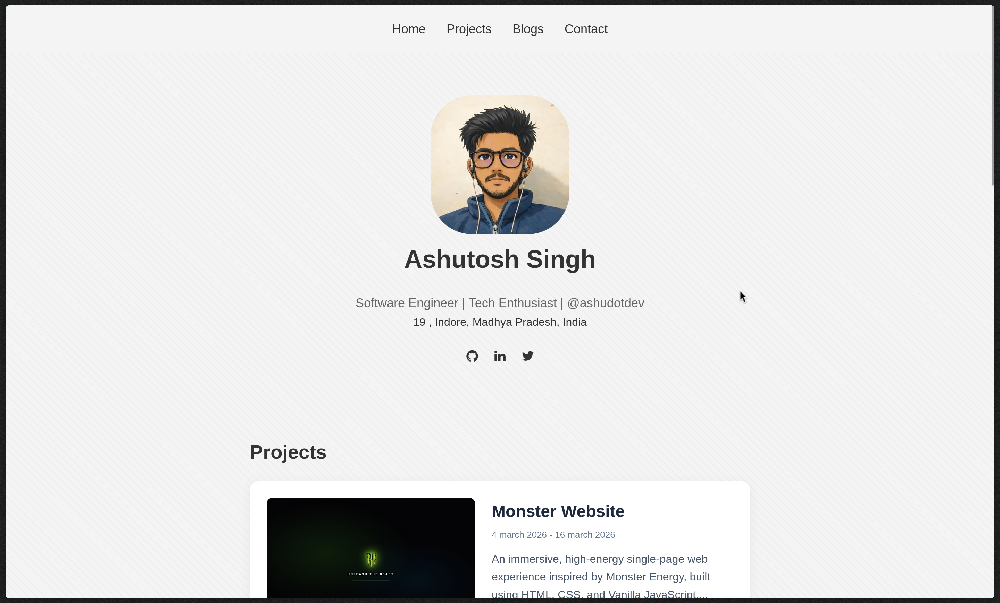

# Ashutosh Singh – Portfolio

<p align="center">
  <a href="https://ashu.fun/">
    
  </a>
</p>

<p align="center">
  <b>Clean • Minimal • Developer Portfolio</b><br/>
  Built with HTML, CSS & Vanilla JavaScript
</p>

---

##  Live Demo

🔗 https://ashu.fun

---

##  Preview

<p align="center">
  
</p>

---

##  Features

-  Sticky navigation bar  
-  Clean hero section with profile & socials  
-  Project showcase with detailed cards  
-  Read More / Read Less functionality  
-  Tech stack tags  
-  Blog section layout  
-  Minimal & clean UI/UX  

---

##  Tech Stack

<p>
  
  
  
</p>

---

##  Key Highlights

- Dynamic **text truncation + toggle system**
- Clean **card-based UI with hover effects**
- Structured and maintainable CSS
- Focus on **readability & hierarchy**

---

##  Project Structure

```

portfolio/
├── index.html
├── src/
│   ├── style.css
│   └── assets/
│       ├── images/
│       └── icons/

````

---

##  Getting Started

```bash
https://github.com/ashudotdev/portfolio.git
cd your-repo
````

Open `index.html` in your browser.

---

##  Future Improvements

*  Add GSAP animations
*  Improve responsiveness
*  Dark mode
*  Backend for blogs

---

##  Author

**Ashutosh Singh**

<p>
  <a href="https://github.com/ashudotdev"></a>
  <a href="https://linkedin.com/in/ashudotdev"></a>
</p>

---

##  Support

If you like this project, give it a ⭐ and share it!


